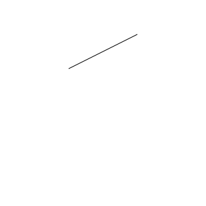

# Paper.js

اسممون و این چیزا

## مقدمه

در ابتدای به وجود آمدن وب، اینترنت از سرعت خوبی برخوردار نبود و به همین دلیل وب سایت ها مجبور بودند که یا از تصاویر گرافیکی استفاده نکنند یا کیفیت آن ها
را کاهش دهند. اما در بسیاری از تصاویر، به ویژه آن هایی که به صورت واقعی عکس برداری نشده اند و با کامپیوتر ساخته شده اند که
در وب نیز بسیار پر کاربرد هستند، از الگو های خاصی پیروی می کنند و نگهداری آن ها به صورت پیکسل به پیکسل، اصلا بهینه نیست. به همین دلیل ائتلاف وب جهانی 
در سال 1998 شروع به استاندارد سازی یک قالب جدید برای تصاویر به نام svg (تصاویر برداری مقیاس پذیر) کرد که به جای استفاده از پیکسل ها برای نمایش تصویر، از
روابط ریاضی که می توانند اشکال پیچیده را توصیف کنند مثل معادلات خط و خم های بزیه استفاده می کند. به این ترتیب تصاویر حجم کمتری می گیرند و هنگام بزرگنمایی
کردن کیفیت خود را از دست نمی دهند.

بعد از استاندارد شدن svg و پشتیبانی از آن توسط مرورگر های وب، به مرور استقبال از این فرمت تصویر بیشتر شد و نرم افزار هایی صرفا برای ایجاد
و ویرایش تصاویر برداری به وجود آمدند. (مانند adobe Illustrator و Inkscape) و هم چنین قابلیت های بیشتری به این استاندارد افزوده شد. یکی
از این قابلیت های افزوده شده svg animation بود که به تصاویر برداری امکان متحرک شدن و حتی تعامل با ورودی های کاربر را می دهد.

اما کار با svg و svg animation سخت است و api مناسبی در اختیار برنامه نویسان نیست. کتابخانه paper.js یک کتابخانه متن باز برای ایجاد تصاویر
و انیمیشن های برداری در بستر وب است که با الگو گیری از توانایی ها و امکاناتی که تصاویر برداری و انیمیشن های برداری دارند، و هم چنین نرم افزار های
دیگر مانند scriptographer در Adobe Illustrator توانسته است یک رابط کاربری برنامه نویسی با طراحی دقیق، خودسازگار و تمیز را برای ایجاد این تصاویر ارائه
دهد.

## دمو

نمونه ای از کار هایی که با این کتابخانه انجام شده است را به همراه کد می توانید در [این لینک](http://paperjs.org/examples/) ببینید.

## آموزش

برای شروع به کار با paper.js می توانید این فایل html را بسازید:
```html
<!DOCTYPE html>
<html>
<head>
<!-- Load the Paper.js library -->
<script type="text/javascript" src="js/paper.js"></script>
<!-- Define inlined PaperScript associate it with myCanvas -->
<script type="text/paperscript" canvas="myCanvas">
    // Your code here. An example:
	// Create a Paper.js Path to draw a line into it:
	var path = new Path();
	// Give the stroke a color
	path.strokeColor = 'black';
	var start = new Point(100, 100);
	// Move to start and draw a line from there
	path.moveTo(start);
	// Note the plus operator on Point objects.
	// PaperScript does that for us, and much more!
	path.lineTo(start + [ 100, -50 ]);
</script>
</head>
<body>
	<canvas id="myCanvas" resize></canvas>
</body>
</html>
```

توصیه می شود که در هر مثال، کد هدف را خودتان بنویسید یا این که کد داده شده را تست کنید و پارامتر های آن را
تغییر دهید تا فرایند یادگیری بهتری داشته باشید.

## ایجاد تصاویر

بیایید با کد ساده ای که در قسمت بالا داشتیم شروع کنیم:

```JS
// Create a Paper.js Path to draw a line into it:
var path = new Path();
// Give the stroke a color
path.strokeColor = 'black';
var start = new Point(100, 100);
// Move to start and draw a line from there
path.moveTo(start);
// Note the plus operator on Point objects.
// PaperScript does that for us, and much more!
path.lineTo(start + [ 100, -50 ]);
```



## تعامل با کاربر

## ایجاد انیمیشن ها

## Paperscript vs Javascript

## استفاده در Node js

## درون پیاده سازی Paper js

